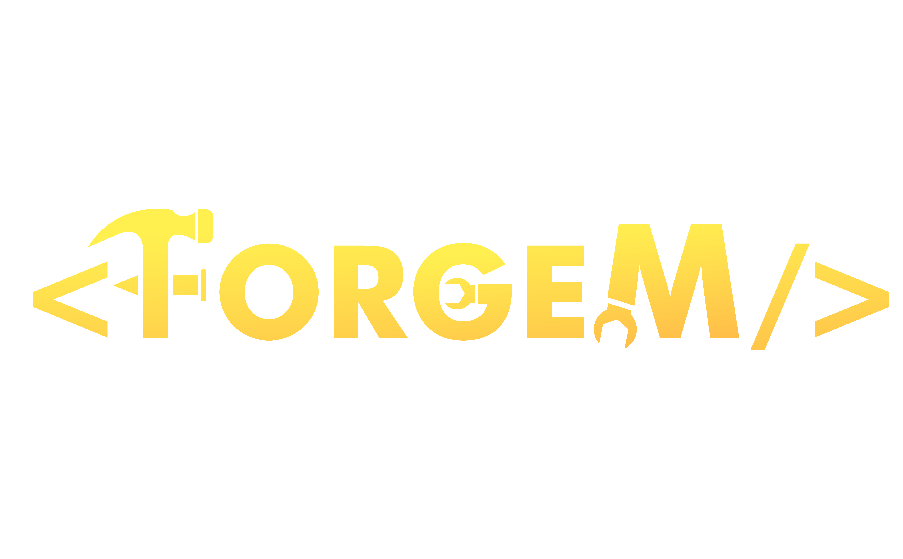

# fmLib - A Multi-Framework Utility Library

fmLib is a versatile library designed to streamline your scripting experience by consolidating various frameworks, resources, and utilities into a single, cohesive package. The goal of fmLib is to provide a convenient wrapper that simplifies the integration of commonly used tools and functionalities. fmLib also provides a set of modules that can be used to enhance your scripts.

## Overview

fmLib is an WiP (Work in Progress) project developed for personal use, containing a collection of modules and wrappers that the author finds valuable for creating scripts in FiveM. While it may not encompass every possible resource or framework, it aims to cover a broad spectrum of commonly used tools, making it a valuable asset for developers.

## Features

- **Framework Wrappers:** fmLib wraps various frameworks, providing a unified interface for easier access and manipulation.

- **Modules:** fmLib includes a set of modules that can be used to enhance your scripts. These modules are designed to be as lightweight as possible, and can be used independently of the framework wrappers.

- **WiP:** fmLib is a WiP project, and will continue to be updated with new features and modules.

- **Documentation:** fmLib includes a comprehensive documentation that covers all of its features and modules.

## Documentation

Coming soon.

## Installation

1. Download the latest release from the [releases](https://github.com/meesvrh/fmLib/releases) page.
2. Extract the archive to your resources folder.
3. Add ```ensure fmLib``` to your server.cfg.
4. Make sure to add ```ensure fmLib``` after any framework resources that you want to use fmLib with (such as ESX or QBCore).
5. Make sure to add ```ensure fmLib``` before any resources that depend on fmLib.
6. Restart your server.

## Usage
```FM = exports['fmLib']:new()```

## Credits

fmLib extends its gratitude to the following frameworks, resources, or other open-source projects that it integrates with:

- [ESX Framework](https://github.com/esx-framework)
- [QBCore Framework](https://github.com/qbcore-framework)
- [Joy UI](https://mui.com/joy-ui/getting-started/)

Thank you to the entire open-source community for fostering an environment of collaboration and shared knowledge.